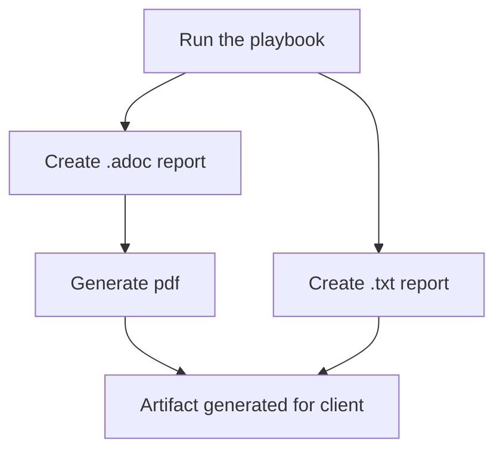

# automated_satellite_health_check

The goal of this project is to automate a Satellite 6 health check. The idea behind this project is that the playbook can be run on a Satellite server to collect a vast quantity of information that is populated directly into an organised text-file report that can be analysed. This allows a consultant more time for analysis and recommendations, rather than conducting information gathering activities. 

This project also allows a consultant to produce a PDF file of the report that is easy to read and ascii-doc formatted. For instructions on how to do this, scroll down to 'Usage'.

It is based on the RHEL Automated Health Check started by *Rodger Li (rodli@redhat.com)* available [here](https://gitlab.consulting.redhat.com/automated_health_check_crew/rhel).  Using the RHEL health check in conjunction with the Satellite health check can allow a consultant to gain detailed insight on hosts associated with the Satellite, and can help add granularity if needed.


## Description
This project uses Ansible to automate certain components of a Satellite health check. It can be used to produce a "leave-behind" high level document providing the reader with an easy-to-read summary of the health of their Satellite server system.

Two similar existing Satellite health check CER templates which have informed this project can be found [here](https://gitlab.consulting.redhat.com/customer-success/consulting-engagement-reports/client-cers/viavi-satellite-6-healthcheck) and [here](https://gitlab.consulting.redhat.com/customer-success/consulting-engagement-reports/client-cers/asml/2021-01-asml-satellite-healthcheck).


## Cloning this repository
To clone this repository and get started on contributing, type the following commands into the CLI:
```
cd existing_repo
git remote add origin https://gitlab.consulting.redhat.com/anz-consulting/satellite/automated_satellite_health_check.git
git branch -M main
git push -uf origin main
```
More information on contributing and GitOps can be found in the CONTRIBUTING.md file.

# Using this playbook
Running this playbook enables a consultant to generate both .txt and .adoc reports. The .txt report may be useful for a technical audience or can serve as a low-storage artifact left behind on a system for reference by sysadmins or other techincal staff at the client site. The .adoc report enables the generation of a PDF report which is easy to read and can be suited for a wide range of audiences. This report is also formatted in line with Red Hat style conventions and can thus be used as a business tool. 



To generate the PDF report, certain elements should be tweaked by the consultant prior to running the script. Instructions for this step are explained below.

### Generating the reports (.txt and .adoc)
The following instructions allow the user to conduct a Satellite health check on their local machine. **Please note that to use this playbook, you will have to insert the IP address(es) of the Satellite(s) being checked in both the inventory file and the ansible_hc_init.yml file prior to running the playbook.**
```
$ git clone <url>
$ cd ~/automated_satellite_health_check
$ ansible-playbook satellite_hc_init.yml -u <root_user> --ask-pass
>Enter root password
$ cat ./satellite_hc_report_<satellite_hostname>
```

**How to Generate the PDF Report:**

IMPORTANT: Ensure you have changed the customer variables listed in vars/customer-vars.adoc prior to commencing the PDF Generation.

**Variables explained:**
- /vars/customer-vars.adoc --> These variables are where the customer name, customer, and the customer short name are inserted. You can use these to further customise the report content. The variables outlined here are the ones that help name the PDF report, so please take care to fill this out.
- /vars/document-vars.adoc --> This document-vars.adoc file contains mainly static/routine variables for the CER. It should not contain customer specific variables related to the customer name and related information. You should not need to change these to run the PDF generation script.
- /vars/redhat-vars.adoc --> This contains short names for products. Now, you can for instance write {rhel} in the CER which will render to the full product name. 
- /vars/render-vars.adoc --> This describes how the file is created. Might be put into the styles/pdf later. This probably won't need to be changed for the report either.

**Generating the PDF report:**
```
$ cd ~/automated_satellite_health_check
$ sh generate-pdf -f 'satellite_hc_report"<satellite_hostname>".doc'
```
This will produce a ready-to-use report. If you wish to add any additional sections, topics, or discussion (such as filling out the tables within the document), you will have to edit the .adoc file that is autopopulated by the ansible playbooks. Otherwise, if you think there is an important section missing, feel free to reach out and we can add the feature in.

[NOTE] Use sh generate-pdf -h to learn more about the PDF generation options available to you.

*******

# Project Rationale
### Strengths
- Ansible is agentless, so as long as the controller has an ssh connection (or is local), then it is possible to run an Ansible automated health check across a large fleet.
- Ansible is declarative code, therefore it is easier to read because developers state what they want the program to do, rather than describe how to do it.

### Weaknesses
- The customer will need to install Ansible on their system, in order to use this automated health check.
- There is a dependency on python packages, so their version needs to match what the Ansible interpreter requires.
- The custom and unique nature of Satellite deployments means that this Ansible playbook may need to be amended to ensure all contents of the Satellite deployment are captured.
- This playbook does not autopopulate the CER template. This is an opportunity that can be investigated.

### Opportunities
- More time for the consultant to add value - perform analysis and recommendations, rather than gather information.
- Standardise Satellite health check engagements at a high level.
- The ability to autopopulate a CER report with the playbook, or covert the findings into a presentation would be a great feature in the future. NOTE: A team in the US has automated CER autopopulation for an OCP health check. The mechanics of the health check are different to the mechanics used in this project, but this may be of use in the future:
https://search-portfolio-hub.6923.rh-us-east-1.openshiftapps.com/serviceskit/openshift_health_check

### Threats
- Lack of adoption due to consultant not being familiar with the tool.
- Will the tool output recommendations? Who owns and takes responsibility for recommendations?
- Product ownership - who will own and maintain this tool?
- Difficulty of advanced features such as CER autopopulation, may require the input of consultants or knowledge-holders with advanced Satellite, CER, Ansible or asciidoc skills.


*******
# Admin Section

## Support
- Create a card on the Kanban board for action.
- Email or message any of the contributors for the project.
- Refer to internal Red Hat documents or Red Hat product Google Spaces for advice or extra documentation.

## Roadmap

Milestone 1: Project started
Date: 12/12/22

Milestone 2: Began adding roles
Date: 16/01/23

Milestone 3: Finished first prototype
Date: 20/01/23

Milestone 4: Added PDF-generation capabilities
Date: 25/01/23

Milestone 5: Added RH styling conventions and finalised project structure.

## Contributing
We are open to contributions. 
We need designers who can identify problems, suggest improvements or features, and co-create solutions with engineers. Please reach out to any of the contributors if you're interested in helping out! :-)


## Contributors
Project Owner - Sasha Personeni spersone@redhat.com
Maintainer - Elise Elkerton eelkerto@redhat.com
