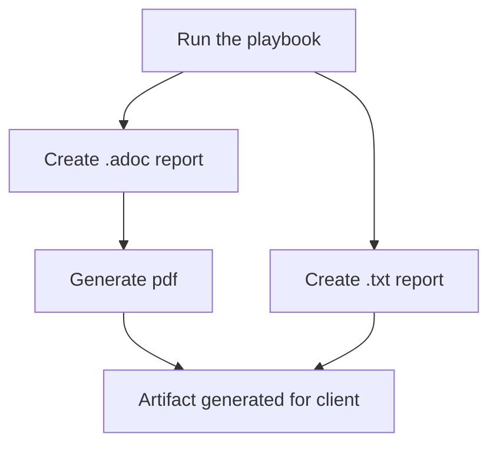

# automated_satellite_health_check

The goal of this project is to automate a Satellite 6 health check. The idea behind this project is that the playbook can be run on a Satellite server to collect a vast quantity of information that is populated directly into an organised text-file report that can be analysed. This allows a consultant more time for analysis and recommendations, rather than conducting information gathering activities. 

This project also allows a consultant to produce a PDF file of the report that is easy to read and ascii-doc formatted. For instructions on how to do this, scroll down to 'Usage'.

It is based on the RHEL Automated Health Check started by *Rodger Li (rodli@redhat.com)* available [here](https://gitlab.consulting.redhat.com/automated_health_check_crew/rhel).  Using the RHEL health check in conjunction with the Satellite health check can allow a consultant to gain detailed insight on hosts associated with the Satellite, and can help add granularity if needed.


## Description
This project uses Ansible to automate certain components of a Satellite health check. It can be used to produce a "leave-behind" high level document providing the reader with an easy-to-read summary of the health of their Satellite server system.

Two similar existing Satellite health check CER templates which have informed this project can be found [here](https://gitlab.consulting.redhat.com/customer-success/consulting-engagement-reports/client-cers/viavi-satellite-6-healthcheck) and [here](https://gitlab.consulting.redhat.com/customer-success/consulting-engagement-reports/client-cers/asml/2021-01-asml-satellite-healthcheck).


## Cloning this repository
To clone this repository and get started on contributing, type the following commands into the CLI:
```
cd <desired_location>
$ git clone https://gitlab.consulting.redhat.com/anz-consulting/satellite/automated_satellite_health_check.git
git branch -M main
```
More information on contributing and GitOps can be found in the CONTRIBUTING.md file.

## Usage

For more information, refer to the [User Guide](https://gitlab.consulting.redhat.com/anz-consulting/satellite/automated_satellite_health_check/-/blob/main/user_guide.md?ref_type=heads)

## About this playbook
Running this playbook enables a consultant to generate both .txt and .adoc reports. The .txt report may be useful for a technical audience or can serve as a low-storage artifact left behind on a system for reference by sysadmins or other techincal staff at the client site. The .adoc report enables the generation of a PDF report which is easy to read and can be suited for a wide range of audiences. This report is also formatted in line with Red Hat style conventions and can thus be used as a business tool. 



*****
# Admin Section

## Support
- Create a card on the Kanban board for action.
- Email or message any of the contributors for the project.
- Refer to internal Red Hat documents or Red Hat product Google Spaces for advice or extra documentation.

## Roadmap

Milestone 1: Project started
Date: 12/12/22

Milestone 2: Began adding roles
Date: 16/01/23

Milestone 3: Finished first prototype
Date: 20/01/23

Milestone 4: Added PDF-generation capabilities
Date: 25/01/23

Milestone 5: Added RH styling conventions and finalised project structure.

## Contributing
We are open to contributions. 
We need designers who can identify problems, suggest improvements or features, and co-create solutions with engineers. Please reach out to any of the contributors if you're interested in helping out! :-)

## Contributors
Authors:
- Sasha Personeni
- Maurice Burrows
- Dane Butler
- Andrew Spurrier
- Elise Elkerton

Project Owner: Sasha Personeni spersone@redhat.com

Maintainer: Elise Elkerton eelkerto@redhat.com
